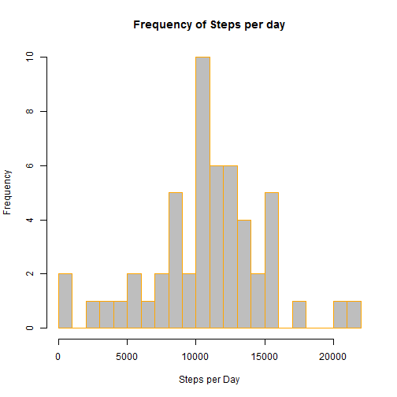

# Reproducible Reseach: week2 Peer_graded Asignment


## Loading and preprocessing the data

#### 1. Read the data file in.

```r
Raw_data<-read.csv("./data/activity.csv",header=TRUE, sep=",")
Value_data<-subset(Raw_data, !is.na(Raw_data))
```

#### 2.Sum the number of steps per day

```r
Sum_day_data<-aggregate(steps~date, data=Value_data, sum)
```

#### 3.Create a histogram of the results

```r
hist(Sum_day_data$steps, main="Frequency of Steps per day", xlab="Steps per Day", border="orange", col="grey",breaks = 20)
```



## What is the mean total number of steps taken per day?
#### 1. Calculate the mean and median of the steps per day

```r
Mean_day_steps<-mean(Sum_day_data$steps)
Median_day_steps<-median(Sum_day_data$steps)
```
* Mean of the steps per day: 1.0766189 &times; 10<sup>4</sup>
* Median of the steps per day: 10765

## What is the average daily activity pattern?

#### 1. Get the average steps per 5 minute interval

```r
Avg_5min_steps<-aggregate(steps~interval, data=Value_data, mean)
```

#### 2. Make a time series plot

```r
plot(Avg_5min_steps$interval,Avg_5min_steps$steps, type="l",col="blue", main="steps per 5 minute interval",ylab="Steps",xlab="Interval")
```


#### 3. Which 5-minute interval, on average across all the days in the dataset, contains the maximum number of steps?

```r
Max_interval_steps <- Avg_5min_steps$interval[which.max(Avg_5min_steps$steps)]
```
* The most steps at interval:835

## Imputing missing values

#### 1. Caculate and report the total number of missing values in the dataset

```r
  Num_nas_dataset<-length(which(is.na(Raw_data)))
```

* Number of missing values: 2304

#### 2. Devise a strategy for filling in all of the missing values in the dataset.


```r
Imputed_data <-merge(Raw_data, Avg_5min_steps,by="interval")
```

#### 3. Create a new dataset that is equal to the original but with the miss data replace NA values with mean of steps values for that time interval.


```r
  Nas_data<-which(is.na(Imputed_data$steps.x))
  Imputed_data$steps.x[Nas_data]<-Imputed_data$steps.y[Nas_data]
```

#### 4. Create a histogram of the new dataset.


```r
Sum_day_newdata<-aggregate(steps.x~date, data=Imputed_data, sum)
hist(Sum_day_newdata$steps.x, main="Frequency of Steps per day", xlab="Steps per Day", border="blue", col="grey",breaks = 20)
```


#### 5. Calculate the new mean and median of the steps per day

```r
Mean_steps_new<-mean(Sum_day_newdata$steps.x)
Median_steps_new<-median(Sum_day_newdata$steps.x)
```
* The nea mean of the steps per day is :1.0766189 &times; 10<sup>4</sup>
* The nea median of the steps per day is :1.0766189 &times; 10<sup>4</sup>
```

## Are there differences in activity patterns between weekdays and weekends?
#### 1. Create a new factor variable in the dataset with two levels-"weekday" and "weekend" indicating whether a given date is a weekday or weekend day.


```r
Imputed_data$dateType <-  ifelse(as.POSIXlt(Imputed_data$date)$wday %in% c(0,6),'weekend','weekday')
```

#### 2. Make a panel plot containing a time series plot


```r
Avg_steps_dateType <- aggregate(steps.x ~ interval + dateType,data = Imputed_data,mean)

ggplot(Avg_steps_dateType,aes(interval,steps.x))+
    geom_line(col="blue")+
    facet_grid(dateType~.)+
    xlab("5-minute interval")+
    ylab("avarage number of steps")
```


